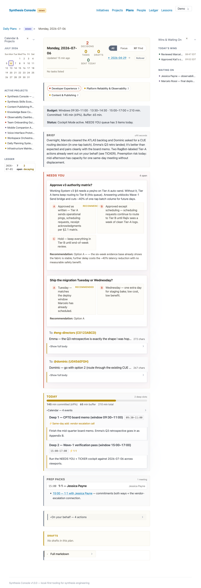
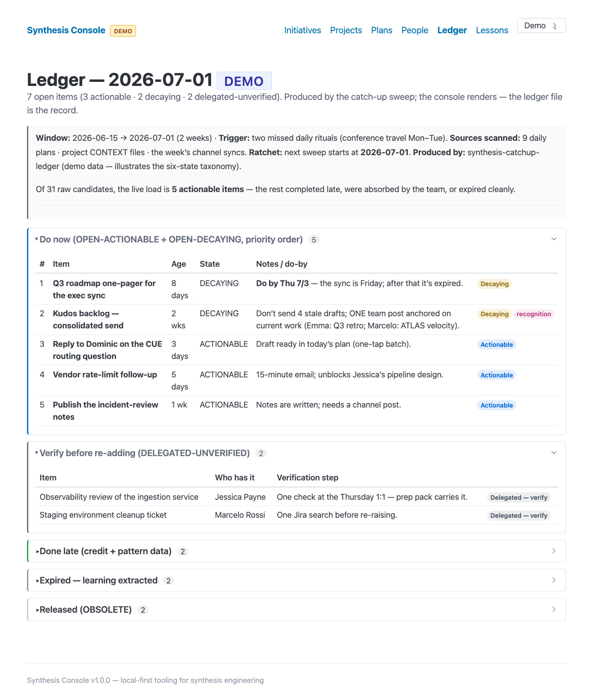
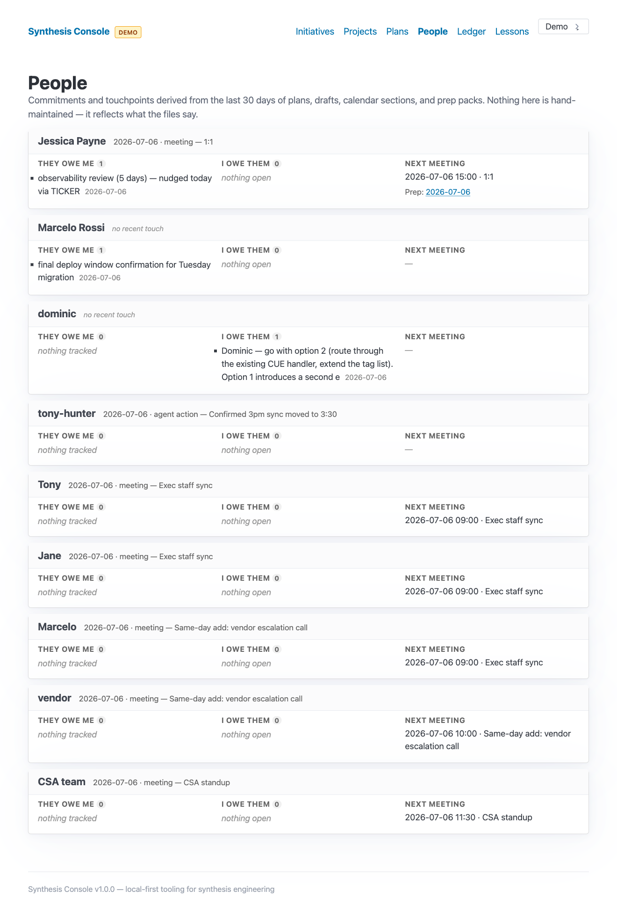

# Synthesis Console

Local-first, open-source tooling for synthesis engineering. Renders your project management YAML and markdown files as browsable, searchable pages in a web browser.

Read the full story: [Synthesis Console: open-source tooling for synthesis engineering](https://synthesiscoding.org/articles/synthesis-console-open-source-tooling-for-synthesis-engineering/)


## What Is This?

If you practice synthesis engineering — managing projects through structured markdown and YAML conventions — you accumulate files: project indexes, working context documents, reference files, session archives, lessons learned. These files are the working memory of your practice. But browsing them means reading raw files in a text editor or asking your AI agent to parse them.

Synthesis Console renders those files as a browsable console. Project list with status badges and tag filtering. Project detail with rendered markdown. Session history. Lessons learned. All from the files you already have, with no import step and no database.

Synthesis engineering is a discipline for structured human-AI collaboration — like agile or Scrum, but for AI-native workflows. This console is one open-source implementation of the tooling layer. Others can build their own.

## Screenshots

**Project list** — grouped by initiative with status badges, search, and filter toggles:


**Initiatives** — portfolio-level view across active sources (v0.3+):


**Status filtering** — click status toggles to show specific groups:


**Project detail** — metadata sidebar with rendered CONTEXT.md and REFERENCE.md:


**Lessons** — cross-project lessons learned, date-sorted:


**Daily plans** — calendar navigation with today highlighted, click any date to view:


**Plan detail** — rendered daily plan with Slack mention pills, channel pills, and a per-draft action bar (Copy + Open-in-Slack here on the demo source; Edit + Send-to-Slack appear on editable, token-configured sources):



## What v1.0 adds — Cockpit Mode: the transaction cockpit

v1.0 completes the console's graduation from *plan viewer* to *transaction cockpit* — the surface a person works FROM between meetings, not just a rendering they glance at. It pairs with Cockpit Mode plans (synthesis-daily-rituals v2.10+): budget-bound, stakes-routed daily plans built for calendars that preempt.

**Five new plan-page surfaces**, rendered only when the plan carries the corresponding sections (legacy plans render exactly as before):

- **Portfolio lane strip** — one chip per active initiative across ALL active sources, worst health first. Health is file-derived: explicit 🔴 / ⚠️ / ✅ markers in member projects' CONTEXT.md win; staleness of `last_session` contributes at most a warning (inference prompts a check-in; only an explicit assertion raises an alarm). There is no hand-curation UI — lanes are ritual-generated or they rot.
- **BRIEF** — the ≤90-second morning narrative (`## 📰 Brief`), always visible below the day header.
- **NEEDS YOU** — the one-tap queue: a priority decision from `## ⚡ Decision needed` plus drafts and light decisions from `## ☑️ One-tap batch`, each as a compact card with **Approve / Edit / Skip**. Skip writes a `**Skipped:**` marker (undoable); Approve sends through the existing confirm-modal Slack flow, or Smart-Copies when no token is configured. Target: clear the queue in ≤10 minutes, twice a day.
- **TODAY** — the day's time budget as a bar (committed vs buffer, with a warning state above the 70% guideline), the ritual-written `## 📅 Calendar`, and the ≤3 deep-work slots with window chips; a calendar event overlapping a slot's window flags ⚡ preemption — visualized, not mourned.
- **TICKER** — the "On your behalf" digest (`## On your behalf`): every agent-sent action with time, target, and permalink. Trust through total visibility.

**Two new top-level views:**

- **People** (`/people`) — a commitments view derived at read time from the last 30 days of plans and prep packs: who owes me, whom I owe (open drafts), last touch, next meeting, prep-pack links. No roster file to maintain — the view is as true as the files.
- **Ledger** (`/ledger`) — catch-up ledgers (synthesis-catchup-ledger skill) rendered live with the six-state taxonomy: actionable, decaying (with do-by), delegated-unverified, done-late, expired-with-lesson, released. Recognition-class rows get a tag so the consolidated-kudos decay pattern stays visible.

**Plus:** meeting-prep packs — ritual-generated one-pagers at `meeting-preps/YYYY-MM-DD-HHMM-slug.md` (calendar × transcripts × project context × open commitments), listed as cards on the plan page and rendered at `/prep/:source/:slug`.

**The v1.0 cockpit** — portfolio strip, budget bar, BRIEF, NEEDS YOU one-taps, TODAY slots with preemption flags, prep packs, TICKER (see the plan-detail screenshot above under Screenshots).

**Ledger** — the six-state commitments reconciliation, rendered live:



**People** — commitments and touchpoints, derived entirely from files:



Producer contracts for all of the above live in [`docs/cockpit-design.md`](docs/cockpit-design.md) and the synthesis-daily-rituals / synthesis-catchup-ledger skills — producer and consumer change together.

## What v0.9+ adds for daily plans

The plan detail view becomes a **three-column cockpit**: calendar + active projects on the left, today's actionable work in the center, today's wins + waiting-on others on the right. Color through left-border accents on cards rather than oversized headings; compact rows; sent/done items collapse by default. At <1024px the columns collapse to a single column with sidebars rendered as `<details>` blocks above the main content.

The previous single-column cockpit (v0.8) is the source for the typed sections; v0.9 reorganizes the rendering, not the underlying model. Existing CSS and JS handlers (decision pick, task checkbox, filter chips, find, mtime auto-refresh) work unchanged.

- **Left sidebar** — mini month calendar with the current date highlighted and other dates that have plans linked; active projects list (filtered to active / ongoing / new / paused statuses) with color-coded status dots.
- **Main column** — date header, progress bar (X / Y tasks done), counts strip (decisions / tasks / drafts / sent today), filter chips · find · Rollover · prev/next nav, then `MUST DO TODAY` (open decisions + P0 tasks promoted), `DO THIS WEEK` (P1 / P2 / watch / stale buckets), `DRAFTS` (active + sent cards from v0.8.5–v0.8.7), `MORE` collapsibles (briefing / standup / PR queue / sync state / other), and the Full markdown escape hatch.
- **Right sidebar** — Today's Wins (done priority tasks + sent drafts + explicit `## Completed today` / `## Sent messages` sections, deduplicated), Waiting On (`## Waiting on others` sections).

## What v0.8+ adds for daily plans

The plan detail view becomes a **cockpit**: a typed, sectioned rendering that surfaces what needs your attention now, with action affordances per section type.

- **Glance bar** — last-modified timestamp, live counts (open decisions, tasks done / total, drafts, sent today), prev/next navigation, and a **Rollover** link to the cross-day carryover view.
- **NEEDS YOU** region surfaces open decisions detected from `Decisions needed` H2 sections. Each card shows the question + options as buttons; clicking an option records a `**Decided:** Option X — <ISO>` marker back to the file.
- **TODAY** region groups priority tasks by H3 bucket (e.g. "Do today — not negotiable" / "Stale targets"). Each task is a checkbox; clicking writes a strike-through + `✅ DONE HH:MM TZ` marker back to the file. Already-done tasks render in muted color with the timestamp visible.
- **DRAFTS** region passes through to the existing v0.6 action bar (Copy / Edit / Open in Slack / Send-to-Slack) — no behavior change.
- **Lower-row collapsibles** for briefing, standup, waiting-on, sent log, PR queue, sync state, and a "Full markdown" escape hatch that always shows the original render.
- **Filter chips** for `All` / `Focus` (strips the page to NEEDS YOU + DRAFTS + first task bucket) and `Find` (in-page search that highlights matches across collapsed sections).
- **Compare-and-swap discipline** for all writes — same atomic temp-file-plus-rename pattern as v0.5 / v0.6. If the file changed since the page loaded, the server returns 409 with a "reload and retry" message.
- **Auto-refresh on file change (v0.8.4+)** — the page polls the file's mtime every 30 seconds and soft-reloads when the plan has been written by another actor (a daily-rituals run, slack-sync, or a manual edit in another editor). Reloads are skipped while you're mid-edit, the Send modal is open, or any text input has focus.
- **Cross-day rollover view (v0.8.4+)** at `/plans/:source/rollover` — surfaces priority tasks that have appeared in multiple plans without being marked done. Click through any occurrence to that day's plan. Threshold chips (≥7 / ≥14 / ≥30 days) frame how aggressively the view filters.
- **Section-classification audit (v0.8.4+)** — `bun run scripts/audit-section-classification.ts [plansDir]` walks a plans directory, classifies every H2 by kind, and reports the share that fall through to "other". Use it as a regression check on the producer-consumer contract: rising fallthrough means the daily-rituals skill has adopted vocabulary the cockpit doesn't recognize, and the two should be brought back into sync.

The cockpit is opt-in via heuristic — plans with no recognizable section structure fall through to plain markdown rendering. See [`docs/cockpit-design.md`](docs/cockpit-design.md) for the full design and supported H2/H3 vocabulary.

## What v0.6+ adds for Slack-aware drafts

- **Mention pills.** Canonical Slack syntax in draft bodies (`<@U0AG66Z95KM>`, `<#C012345|name>`) renders as visible pills with the resolved display name, so you see at a glance which tokens will trigger a notification.
- **Smart Copy.** Display-form references (`@Saner`, `#mmc-product-growth-squad`) are rewritten to canonical syntax in the clipboard before copy completes — Slack resolves canonical syntax regardless of source path, so paste-and-send produces real mentions.
- **Reliable Open-in-Slack.** With `workspace_url` configured, links use the `https://workspace.slack.com/archives/<channelId>` permalink form (always lands correctly). The bare-name `slack://` scheme is documented as unreliable and only used as last-resort fallback.
- **Inline edit.** Click Edit on any draft, modify the message in a textarea, click Save (or Cmd/Ctrl+Enter) — change is written back to the source markdown via compare-and-swap. Stale state returns 409 with a "reload and try again" message.
- **Direct Slack send.** With a user OAuth token (`xoxp-...`) configured, drafts gain a Send-to-Slack button. Click opens a confirmation modal with target preview, mentions summary, and full body. Confirm and the message goes via `chat.postMessage` as you, with the file annotated `**Sent:**` and the body strikethrough'd on reload.
- **Keychain-backed token storage.** Tokens live in the macOS Keychain (encrypted at rest, not Spotlight-indexed, not in Time Machine). The autostart wrapper script reads tokens from the Keychain at launch — no cleartext token in any plist or shell init file.

Setup: `SLACK_USER_TOKEN_RAJIV='xoxp-...' bun run setup-slack <source-name>` does it all in one shot. See [`docs/slack-integration.md`](docs/slack-integration.md) for full details.

## Quick Start

```bash
# Install Bun (if needed)
curl -fsSL https://bun.sh/install | bash

# Clone and run
git clone https://github.com/synthesisengineering/synthesis-console.git
cd synthesis-console
bun install

# Try with sample data first
bun run demo

# Then with your own data
bun run start
```

Open http://localhost:5555 in your browser.

## Configuration

Copy `console.yaml.example` to `~/.synthesis/console.yaml` and edit to match your layout.

```yaml
sources:
  - name: personal
    root: ~/knowledge/personal
    projects_dir: projects
    lessons_dir: lessons
    plans_dir: daily-plans
    default_active: true

  - name: example-client
    root: ~/workspaces/example-client/knowledge-example-client-private
    projects_dir: projects
    notes_dir: notes

port: 5555
```

### Sources explained

Every source declares:
- `name` (required) — unique identifier used in URLs and the selection cookie.
- `root` (required) — absolute path on disk. Supports `~/` expansion.

Plus any subset of these, by presence, to declare what the source provides:
- `projects_dir` — activates the source in the projects view (expects `{root}/{projects_dir}/index.yaml`).
- `lessons_dir` — activates the source in the lessons view (expects `YYYY-MM-DD-slug.md` filenames).
- `plans_dir` — activates the source in the daily plans view (expects `YYYY-MM-DD.md` filenames).
- `notes_dir` — reserved for the Phase 3 notes viewer.

Optional flags:
- `display_name` — human-readable label in the UI (defaults to `name`).
- `default_active: true` — pre-selected on first run when no cookie is set.
- `demo: true` — marks as demo data; filtered by the `--demo` flag.

### Composition

The picker in the header lets you select any subset of sources as **active**. Projects, lessons, and plans views union the selected sources and show a source badge on each item. Selection persists in the `sc_sources` cookie.

A URL with `?sources=a,b` overrides the cookie for that session — useful for bookmarking or sharing a specific view.

### Daily plans convention

Daily plans are typically person-scoped: one person, one plan per day across all their roles. The convention is to declare `plans_dir` on exactly one source (usually a personal base). If you need per-client or per-business plans, declare `plans_dir` on multiple sources — the console merges them with source badges, and the plans calendar offers a "dates with plans from multiple sources" view below the month.

See [docs/layouts.md](docs/layouts.md) for alternative layout recipes (single monorepo, team-shared + personal overlays, multi-business, team lead tracking reports, legacy underscore-prefixed).

### Auto-detection

If no config file exists, the console scans `~/workspaces/*/` for directories named `ai-knowledge-*` and configures them automatically. It detects both the current layout (top-level `lessons/`, `daily-plans/`) and the legacy layout (`projects/_lessons/`, `projects/_daily-plans/`). The `rajiv` workspace, if present, is marked default-active.

### Port

Defaults to 5555. If the port is busy, auto-increments (5556, 5557, ...) and prints the port it found.

### Portability

All paths use `~/` expansion, so the same config file works across machines with different usernames.

### Initiatives (v0.3+)

Optional portfolio-level containers that group related projects. Declare them in each source's `projects/index.yaml`:

```yaml
initiatives:
  - id: platform
    name: Platform & Infrastructure
    status: active
    description: Core services, reliability, observability.
    lead: Alex

projects:
  - id: logging-unification
    initiative: platform
    name: Unified Logging
    status: active
    ...
```

Target ≤5 initiatives per source. Projects without an `initiative:` field show in an "Ungrouped" section. A new **Initiatives** tab in the nav lets you see portfolio-level status at a glance; the **Projects** view automatically groups by initiative when any are declared. See [docs/initiatives.md](docs/initiatives.md) for the full reference.

### Migrating from v0.1

v0.1 used a `workspaces:` schema with a single-workspace-at-a-time UI. v0.2 replaces that with `sources:` and multi-source composition. See [docs/migration-v0.2.md](docs/migration-v0.2.md) for the 60-second migration. v0.3 adds initiatives as a purely additive feature — no migration required.

## Auto-start on Login

Once you're using the console daily, have it start automatically when you log in. Installed and managed per-user — no root, no system-wide changes.

### macOS (launchd)

```bash
bun run autostart:install
```

Writes a LaunchAgent plist to `~/Library/LaunchAgents/org.synthesisengineering.console.plist`, loads it, and starts the server. Logs go to `~/Library/Logs/synthesis-console/`.

Uninstall:

```bash
bun run autostart:uninstall
```

### Linux (systemd user unit)

```bash
bun run autostart:install
```

Writes a user service to `~/.config/systemd/user/synthesis-console.service`, enables it, and starts it. Logs go through journald:

```bash
journalctl --user -u synthesis-console -f
```

The service runs while you're logged in. To keep it running across logouts, run `loginctl enable-linger "$USER"` once.

Uninstall:

```bash
bun run autostart:uninstall
```

### Windows

Not yet scripted. Two options until then:

- **WSL:** clone the repo inside WSL and use the Linux script.
- **Native:** create a Task Scheduler entry that runs `bun run src/index.ts` from the repo directory at logon. A PR adding a PowerShell installer is welcome.

### What the installer does

The install scripts are shell files in `scripts/` — readable and short. They:

1. Locate your `bun` binary and bake its absolute path into the unit (no PATH surprises at boot).
2. Resolve the repo root from the script's own location, so it works wherever you clone.
3. Set up log paths (`~/Library/Logs/` on macOS, journald on Linux).
4. Restart on crash with a throttle (no hot-loop if the server fails at startup).
5. Are idempotent — re-running regenerates the unit file and reloads.

The server runs on its usual port (5555 by default, auto-incrementing if busy). Open `http://localhost:5555` any time.

## Demo Mode

Demo mode runs the console with bundled sample data — 18 projects across all 7 statuses, plus sample lessons. Three ways to activate:

```bash
bun run demo              # Explicit
bun run start -- --demo   # Flag
# Or just run without config — auto-detects and falls back to demo
```

Demo mode serves three audiences:

1. **You** — take screenshots and write documentation without exposing real project data
2. **First-time users** — evaluate the tool immediately without setting up a workspace
3. **The demo data itself** — serves as documentation-by-example of synthesis project management conventions

A "DEMO" badge in the header makes it clear when you're viewing sample data.

## How It Works

**Runtime:** [Bun](https://bun.sh) — fast JavaScript/TypeScript runtime with built-in TypeScript support.

**Framework:** [Hono](https://hono.dev) — lightweight web framework (~14KB) that also runs on Node.js and Deno.

**Rendering:** Server-side HTML via TypeScript template literal functions. No React, no Vue, no client-side framework, no build step.

**Dependencies:** Three runtime packages total.

| Package | Purpose |
|---------|---------|
| `hono` | HTTP routing and request handling |
| `js-yaml` | Parse project index and config YAML |
| `markdown-it` | Render markdown to HTML (with task-list plugin) |

**How requests work:** Every page load reads files from disk, parses them, and returns rendered HTML. No caching, no database. Edit a markdown file, refresh the browser, see the change.

## Project Management Conventions

The console renders files that follow synthesis project management conventions:

**`projects/index.yaml`** — the master project index:

```yaml
projects:
  - id: my-project
    name: "My Project — A Brief Description"
    status: active          # active | new | paused | ongoing | completed | archived | superseded
    started_date: 2026-01-15
    description: >
      What this project does and why it exists.
    tags:
      - infrastructure
      - tooling
    related:
      - other-project-id
    last_session: "2026-04-12"
```

**`projects/{id}/CONTEXT.md`** — working memory for each project (current state, next steps). Budget: 150 lines.

**`projects/{id}/REFERENCE.md`** — stable facts (architecture, URLs, team). Updated in place.

**`projects/{id}/sessions/YYYY-MM.md`** — session archives, append-only monthly files.

**`{lessons_dir}/YYYY-MM-DD-slug.md`** — cross-project lessons learned. Location is whatever you declare; the canonical layout is top-level `lessons/`.

**`{plans_dir}/YYYY-MM-DD.md`** — daily action plans with prioritized tasks, draft messages, and delegation tracking. Canonical location is top-level `daily-plans/`.

## Daily Plans

The daily plan viewer treats you as one person with one plan per day — regardless of how many workspaces, organizations, or roles you have. Your personal workspace holds your daily plans; the other workspaces hold their projects. The same way a GitHub account is one identity across multiple organizations, your daily plan is one view across all your work.

Plans include draft messages with grounding — each draft shows the research behind it (code commits, test results, Slack threads, deployment status). A visible notice reminds you to review and personalize each draft before sending. The tool does the research; the human adds judgment, timing, and voice.

## The Full System

Synthesis Console is the viewing layer. The methodology that produces the files it renders comes from [synthesis skills](https://github.com/synthesisengineering/synthesis-skills) — a library of open-source agent skills for project management, context lifecycle, daily planning, code review, and more.

To use the complete system:

```bash
# Install the skills (works with Claude Code, Cursor, Codex CLI, and 40+ other agents)
npx skills add synthesisengineering/synthesis-skills --global --all --copy
```

The skills create and maintain the files. The console renders them. Together they form a complete synthesis engineering workflow.

**Learn more:**
- [Synthesis Skills: Install Methodology Into Your AI Workflow](https://rajiv.com/blog/2026/03/18/synthesis-skills-install-methodology-into-your-ai-workflow/)
- [AI-Native Project Management](https://rajiv.com/blog/2025/12/14/ai-native-project-management/)
- [The Tiered Context Architecture](https://rajiv.com/blog/2026/03/01/tiered-context-architecture/)

## Security

Synthesis Console is a **local-only tool** that binds to `localhost`. It reads your own files from your own filesystem.

- **Path traversal:** URL parameters are sanitized to prevent directory traversal attacks
- **XSS:** User-provided data is escaped in HTML output; interactive elements use event delegation instead of inline handlers
- **Markdown HTML:** Rendered without sanitization (deliberate — this is a local tool reading your own files; sanitizing would break legitimate HTML in markdown)

## Contributing

Contributions welcome. Fork, branch, PR.

See [CLAUDE.md](CLAUDE.md) for development conventions if you use Claude Code.

```bash
bun run dev    # Dev mode with file watching
bun run demo   # Run with sample data
```

## License

[Apache 2.0](LICENSE)

---

Built by [Rajiv Pant](https://rajiv.com). Part of the [synthesis engineering](https://synthesisengineering.org) ecosystem.
